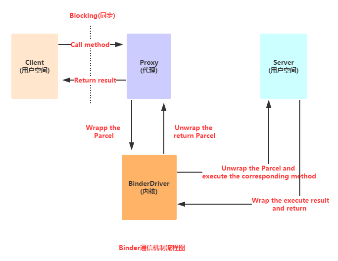

# 记录
起因：工作中项目使用了AIDL的地方，也不大明白为什么，只是简单理解startService、bindService的使用，一知半解

# AIDL
1. 了解AIDL，就肯定会涉及一个概念：Binder和IBinder，但由于Binder机制过于晦涩难懂(至少目前不太懂)，那么直接引用菜鸟教程中对IBinder的总结：
   1. **IBinder是Android给我们提供的一个进程间通信的一个接口，而我们一般是不直接实现这个接口的， 而是通过继承Binder类来实现进程间通信！是Android中实现IPC(进程间通信)的一种方式！**
2. 为什么选择Binder？
   1. 可靠性：在移动设备上，通常采用基于Client-Server的通信方式来实现互联网与设备间的内部通信。目前linux支持IPC包括传统的管道，System V IPC，即消息队列/共享内存/信号量，以及socket中只有socket支持Client-Server的通信方式。Android系统为开发者提供了丰富进程间通信的功能接口，媒体播放，传感器，无线传输。这些功能都由不同的server来管理。开发都只关心将自己应用程序的client与server的通信建立起来便可以使用这个服务。毫无疑问，如若在底层架设一套协议来实现Client-Server通信，增加了系统的复杂性。在资源有限的手机 上来实现这种复杂的环境，可靠性难以保证。 
   2. 传输性能：socket主要用于跨网络的进程间通信和本机上进程间的通信，但传输效率低，开销大。消息队列和管道采用存储-转发方式，即数据先从发送方缓存区拷贝到内核开辟的一块缓存区中，然后从内核缓存区拷贝到接收方缓存区，其过程至少有两次拷贝。虽然共享内存无需拷贝，但控制复杂。比较各种IPC方式的数据拷贝次数。共享内存：0次。Binder：1次。Socket/管道/消息队列：2次。 
   3. 安全性：Android是一个开放式的平台，所以确保应用程序安全是很重要的。Android对每一个安装应用都分配了UID/PID,其中进程的UID是可用来鉴别进程身份。传统的只能由用户在数据包里填写UID/PID，这样不可靠，容易被恶意程序利用。而我们要求由内核来添加可靠的UID。 所以，出于可靠性、传输性、安全性。android建立了一套新的进程间通信方式。
3. 什么是AIDL？
   1. 前面我们讲到IPC这个名词，他的全名叫做：跨进程通信(interprocess communication)， 因为在Android系统中,个个应用程序都运行在自己的进程中,进程之间一般是无法直接进行数据交换的, 而为了实现跨进程，Android给我们提供了上面说的Binder机制，而这个机制使用的接口语言就是: AIDL(Android Interface Definition Language)，他的语法很简单，而这种接口语言并非真正的编程语言，只是定义两个进程间的通信接口而已！而生成符合通信协议的Java代码则是由Android SDK的 platform-tools目录下的aidl.exe工具生成，生成对应的接口文件在:gen目录下，一般是:Xxx.java的接口！ 而在该接口中包含一个Stub的内部类，该类中实现了在该类中实现了IBinder接口与自定义的通信接口, 这个类将会作为远程Service的回调类——实现了IBinder接口,所以可作为Service的onBind( )方法的返回值！
4. AIDL流程：
   
5. 对于初级开发者而言，最重要的事是知道如何去使用，而不过多深入追究其原理，[Binder原理](http://gityuan.com/archive/)

## 如何使用AIDL？
1. 
2. 使用AIDL注意事项：
   1. 接口名词需要与aidl文件名相同
   2. 接口和方法前面不要加访问权限修饰符：public ,private,protected等，也不能用static final!
   3. AIDL默认支持的类型包括Java基本类型，String，List，Map，CharSequence，除此之外的其他类型都 需要import声明，对于使用自定义类型作为参数或者返回值，自定义类型需要实现Parcelable接口， 详情请看后面的传递复杂数据类型
   4. 自定义类型和AIDL生成的其它接口类型在aidl描述文件中，应该显式import，即便在该类和定义的包在同一个包中。
